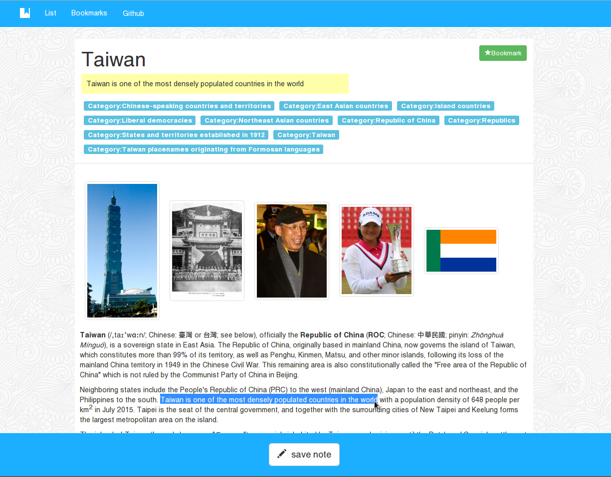

# Introduction

This is a simple Web app practice in using React.

It fetches links from a Wikipedia page, and user could save links as bookmark into local storage.

Besides this, it also has these features

* Use Date-picker to pick another page to provide different links.
* Select text (140 chars) and save it along with bookmark.
* Export bookmarks as JSON file for back-up.

# Development

## Setup

To build and run this project. Built files will be in directory **_build**

```bash
$ npm i
$ npm start

# there are cached JSON file as fake data for development.
# If you want to use it to reduce Wikipedia Server API usage
$ npm run start:fake
```

To run unit-test

```bash
$ npm run test
$ npm run test:watch  # monitor file changes
```

To deploy github-page

```bash
$ npm deploy
```

# Screenshot



Selected text to save it as note.

# Todo

* fix inlined Wikipedia link problem in Detail page.
* i18n
* More test for Redux-flow and Components
* More ES6 syntax and more functional programming style.
* UI hint for AJAX delay, or animation effect.
